# 🩺 Pneumonia Detection using CNN (PyTorch)

A **deep learning** project that detects **pneumonia from chest X-ray images** using a **custom Convolutional Neural Network (CNN)** built from scratch in **PyTorch**.  
The model achieved an impressive **95.7% accuracy** and **0.9913 AUC**, demonstrating strong generalization on unseen data.

---

# Table of Contents

1. [🚀 Why This Matters](#why-this-matters)  
2. [🏗️ Model Architecture](#model-architecture)
3. [📁 Project Structure](#project-structure)
4. [📊 Performance Summary](#performance-summary)  
5. [🔧 How It Works](#how-it-works)   
6. [🛠️ Requirements](#requirements)
7. [▶️ Quick Start](#quick-start)
8. [👤 Author](#author)  

---

## 🚀 Why This Matters <a name="why-this-matters"></a>
Pneumonia is a serious respiratory infection that can be life-threatening if undiagnosed.  
This project demonstrates how **AI and medical imaging** can be combined to detect pneumonia early using **chest X-ray analysis**.

You’ll learn:
- How to build a **CNN from scratch** (no transfer learning, pure PyTorch).  
- How to handle **imbalanced datasets** using `WeightedRandomSampler`.  
- How to compute **accuracy, precision, recall, F1, AUC**, and visualize a **confusion matrix**.  
- How to organize a **clean and reproducible deep learning pipeline**.

---

## 🏗️ Model Architecture <a name="model-architecture"></a>



```mermaid
flowchart LR
    A[Input Chest X-ray 1x224x224] --> B[Conv Block 1 — 32 filters]
    B --> C[Conv Block 2 — 64 filters]
    C --> D[Conv Block 3 — 128 filters]
    D --> E[Conv Block 4 — 256 filters]
    E --> F[Global Avg Pool + Dropout]
    F --> G[Fully Connected Layer 256 → 2]
    G --> H[Output: NORMAL / PNEUMONIA]
```

Each block includes:
- 2x (3x3) conv layers
- BatchNorm + ReLU
- MaxPooling (2x2)

---

## 📁 Project Structure <a name="project-structure"></a>


---

## 📊 Performance Summary <a name="performance-summary"></a>

| Metric               | Value         |
|----------------------|---------------|
| Test Accuracy        | 95.74% ✅     |
| Precision            | 95.75%        |
| Recall (Sensitivity) | 95.74%        |
| F1-Score             | 95.75%        |
| AUC (ROC)            | 0.9913 🏆     |

- 🟢 High recall → minimal missed pneumonia cases
- 🟢 AUC near 1 → strong class separation
- 🟢 Stable validation performance → no overfitting

---

## 🔧 How It Works <a name="how-it-works"></a>

### 🧠 Model Training
- A custom CNN built from scratch in PyTorch.
- Trained using Adam optimizer (lr=0.001) and CrossEntropyLoss.
- Weighted sampling balances the dataset (more pneumonia than normal).

### 🧪 Evaluation
- Metrics: accuracy, precision, recall, F1-score, and AUC.
- Best model saved automatically (`best_pneumonia_model.pth`).
- Detailed confusion matrix and ROC curve visualization.

### 🩻 Data
- Dataset used: Chest X-Ray Pneumonia Dataset (Kaggle)
- 2 classes: NORMAL vs PNEUMONIA
- Train/Validation/Test split

---

## 🛠️ Requirements <a name="requirements"></a>

- Python 3.8+
- PyTorch
- scikit-learn
- NumPy
- matplotlib
- seaborn

---

## ▶️ Quick Start <a name="quick-start"></a>

1. Clone the repo:
   ```bash
   git clone https://github.com/your-username/pneumonia-detection.git
   cd pneumonia-detection
   ```
   
2. Install dependencies:
   ```bash
   pip install -r requirements.txt
   ```
   
3. Download the [Chest X-Ray Pneumonia Dataset](https://www.kaggle.com/paultimothymooney/chest-xray-pneumonia) and place it in the `data/` directory.
   
4. Train the model:
   ```bash
   python train.py
   ```
   
5. Evaluate & visualize results:
   ```bash
   python evaluate.py
   ```
   
---

## 👤 Author <a name="author"></a>
Built with ❤️ by Youssef Ahmed El Demerdash
